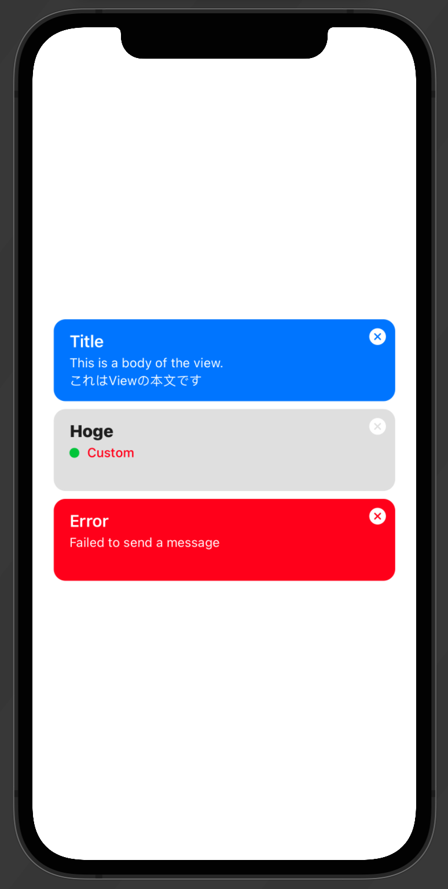

# Deer Design System (DDS)

This is a design system of @mtj0928, by @mtj0928, for @mtj0928.

## Color
You can easily access colors defined in DDS.

```swift
// UIColor or NSColor
DDSColor.primaryTextColor.color
    
// SwiftUI.Color
DDSColor.primaryTextColor.swiftUIColor
```

## Text 
You can easily access labels in DDS.
```swift
// UILabel
UILabel.dds
    .create(for: .footnote, weight: .regular)

// Text
Text("text")
    .preferredFont(for: .footnote, weight: .regular)

```

## Tips
Tips is a view which has title, body and close button.
You can use the view for showing tips about your app.

```swift
// Basic
Tips(title: "Title",body: "This is a body of the view.") {
    print("Closesd")
}
    .foregroundColor(DDSColor.deerBlue.swiftUIColor)
    
// Custom
Tips(title: {
    Text("Hoge")
        .preferredFont(for: .body, weight: .heavy)
        .foregroundColor(DDSColor.primaryText.swiftUIColor)
    }, label: {
        HStack {
            Circle().foregroundColor(DDSColor.deerGreen.swiftUIColor)
                .frame(width: 10, height: 10)
            Text("Custom")
                .preferredFont(for: .footnote, weight: .medium)
                .foregroundColor(DDSColor.deerRed.swiftUIColor)
            Spacer()
        }
    }, closeAction: {
        print("Closesd")
    })
    .foregroundColor(DDSColor.secondaryBackground.swiftUIColor)
```


