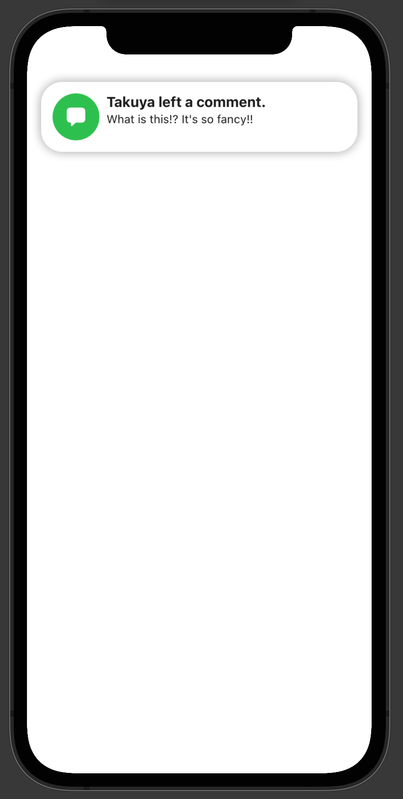

# Deer Design System (DDS)

This is a design system of @mtj0928, by @mtj0928, for @mtj0928.

## Color
You can easily access colors defined in DDS.

```swift
// UIColor or NSColor
Color.dds.primaryTextColor.color
    
// SwiftUI.Color
Color.dds.primaryTextColor
```

## Text 
You can easily access labels in DDS.
```swift
// UILabel
UILabel.dds
    .preferredLabel(for: .footnote, weight: .regular)

// Text
Text("text")
    .preferredFont(for: .footnote, weight: .regular)

```

## Tips
Tips is a view which has title, body and close button.
You can use the view for showing tips about your app.

```swift
// Basic
Tips(title: "Title",body: "This is a body of the view.") {
    print("Closesd")
}
    .foregroundColor(Color.dds.deerBlue)
    
// Custom
Tips(title: {
    Text("Hoge")
        .preferredFont(for: .body, weight: .heavy)
        .foregroundColor(Color.dds.primaryText)
    }, label: {
        HStack {
            Circle().foregroundColor(Color.dds.deerGreen)
                .frame(width: 10, height: 10)
            Text("Custom")
                .preferredFont(for: .footnote, weight: .medium)
                .foregroundColor(Color.dds.deerRed)
            Spacer()
        }
    }, tappedAction: {
        print("tapped background")
    }, closeAction: {
        print("tapped close button")
    })
    .foregroundColor(Color.dds.secondaryBackground)
```


## InAppNotification
You can show notifications in your application.

Preapre instance of `InAppNotificationCenter`.
```swift
let notificationCenter = InAppNotificationCenter.resolve(for: windowScene)
````

If you use SwiftUI, embed notification queue to your view.
```swift
view.environment(\.inAppNotificationQueue, notificationCenter.queue)
```

And, you can show notification by adding notification request to the queue.
```swift
struct YourView: View {
    @Environment(\.inAppNotificationQueue) var queue
    
    var body: some View { ... }
    
    func showNotification() { 
        queue.add(StandardInAppNotificationRequest(
            identifier: UUID().uuidString,
            icon: image,
            title: title,
            body: body
        ))
    }
}
```



### Custom InAppNotification
You can custom view of InAppNotification.

Prepare Cutom `InAppNotificationRequest` like this.
```swift
struct CustomNotificationRequest: View, InAppNotificationRequest {
    let identifier: String
    var view: AnyView { AnyView(self) }
    var duration: TimeInterval? = 3.0

    var body: some View { ... }
}
```

And, add the request to queue.
```swift
queue.add(CustomNotificationRequest(identifier: UUID().uuidString))
```
